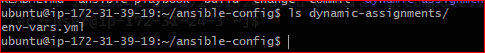
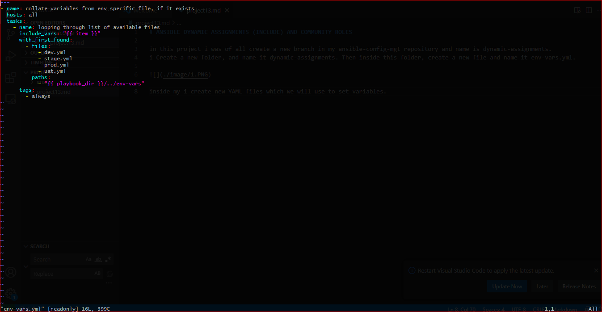
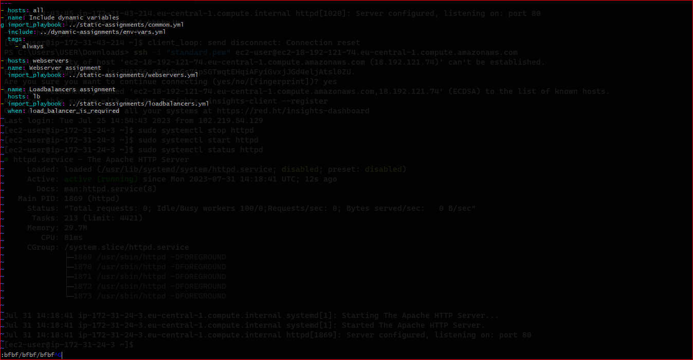
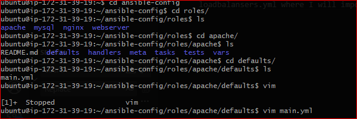
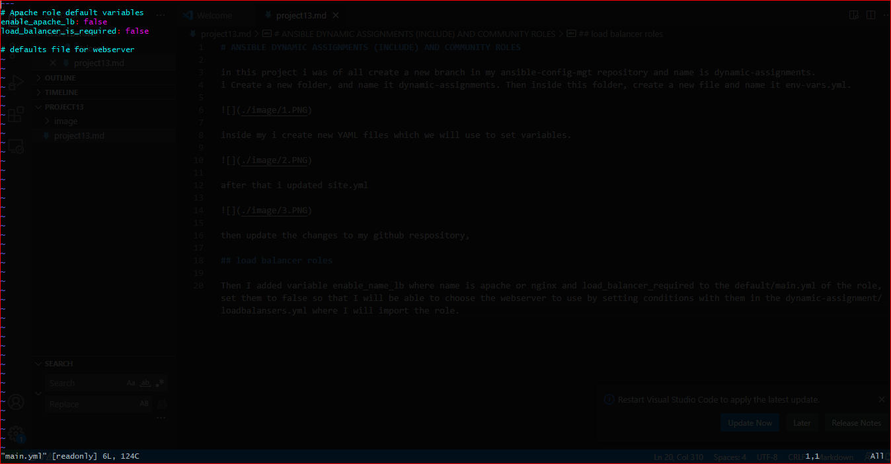
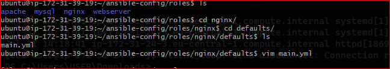
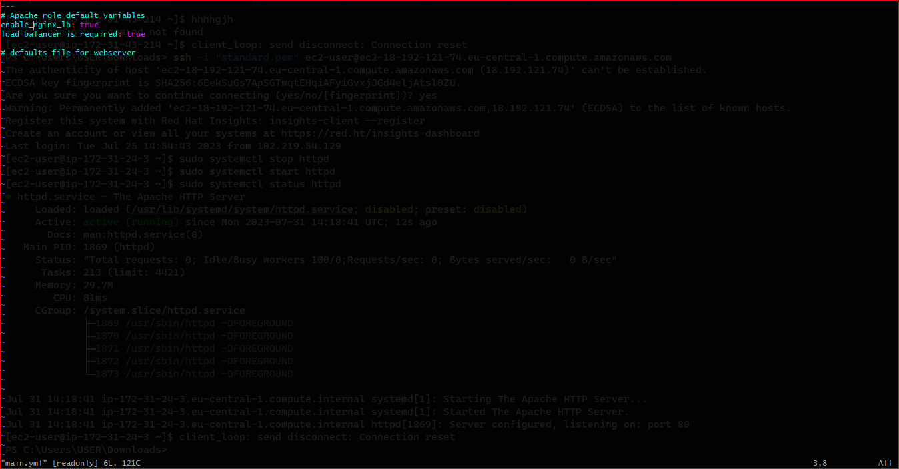
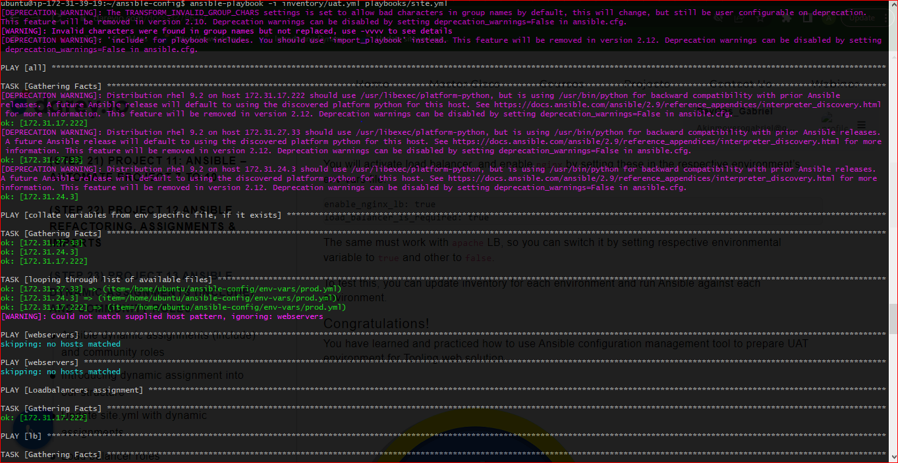
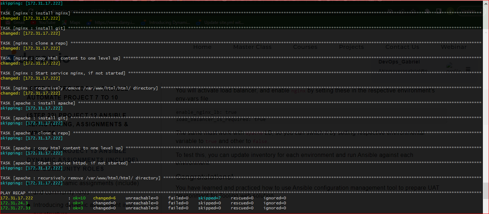

# ANSIBLE DYNAMIC ASSIGNMENTS (INCLUDE) AND COMMUNITY ROLES

in this project i create a new branch in my ansible-config-mgt repository and name is dynamic-assignments.
i Create a new folder, and name it dynamic-assignments. Then inside this folder, create a new file and name it env-vars.yml.

inside my i create new YAML files which we will use to set variables.

after that i updated site.yml 

then update the changes to my github respository,

## load balancer roles

Then I added variable enable_name_lb where name is apache or nginx and load_balancer_required to the default/main.yml of the role, set them to false so that I will be able to choose the webserver to use by setting conditions with them in the dynamic-assignment/loadbalansers.yml where I will import the role. 

then i configure it using the ansible inventory, and playbooks.

thank you